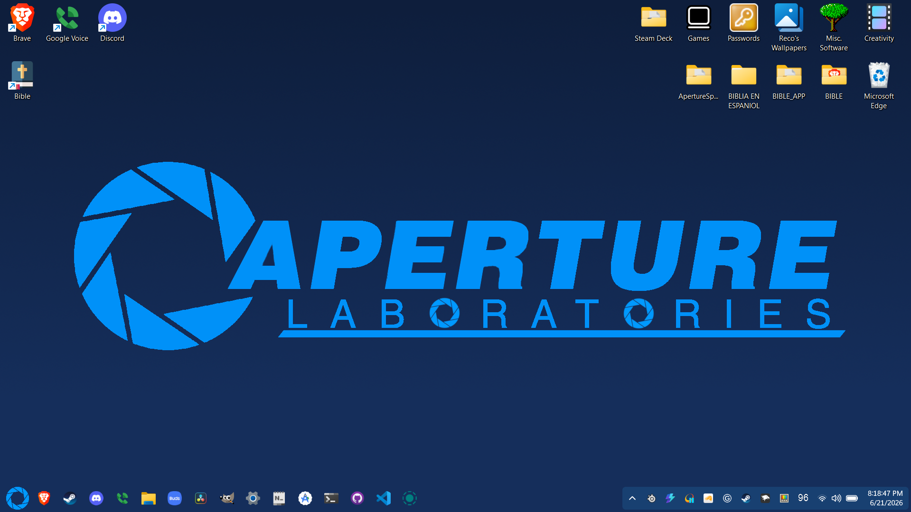
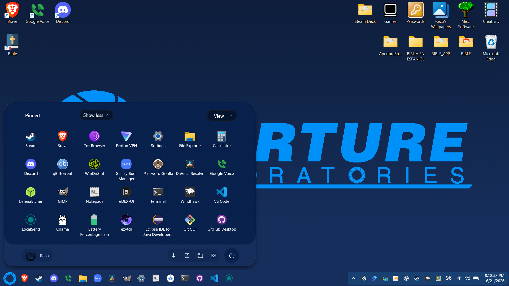
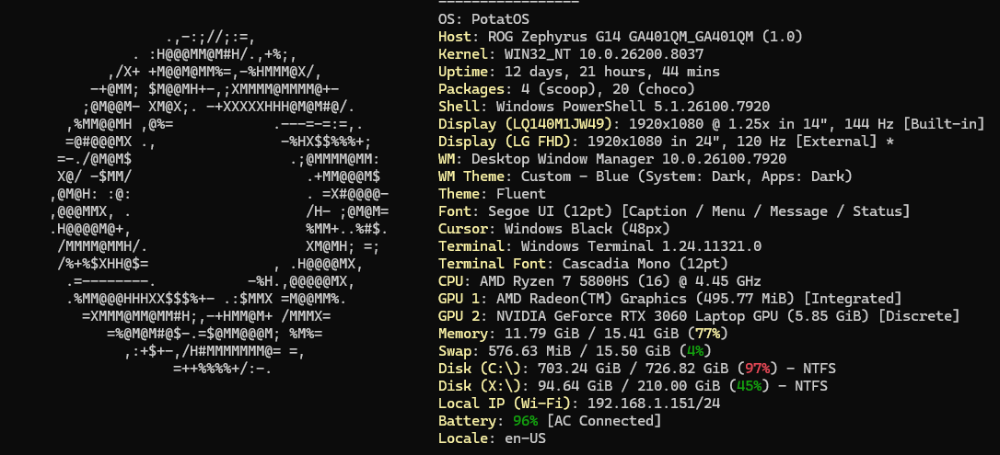

# Windows 11 PotatOS
A customized Windows 11 theme inspired by Aperture Science from Portal, designed to give your desktop a clean, immersive, and experimental facility aesthetic. It transforms the look and feel of the system while preserving Windows functionality.

# What does it look like?
### Desktop:


### Desktop (Open Start Menu):


### Fastfetch (Scoop):


# Installation

## GUI Changes
Install Windhawk and used the "Windows 11 Start Menu Styler" along with the "Windows 11 Taskbar Styler"

In "Windows 11 Start Menu Styler", go to the settings, and select "Textual Mode", and paste in the contents of:
`PotatOS/GUI Changes/Start Menu Styler.txt`

In "Windows 11 Taskbar Styler", again select "Textual Mode" and paste in the contents of:
`PotatOS/GUI Changes/Taskbar Styler.txt`

This complicates things because it replaces the Windows 11 logo to the Aperture Science logo.
You will need to clone the repo and in line 164 of the Taskbar Styler's settings, you will need to replace "YOUR USERNAME" with your Windows username:

```xml
Background:=<ImageBrush Stretch="Uniform" ImageSource="C:\Users\YOUR_USERNAME\PotatOS\Images\Aperture.ico" />
```

## Fastfetch Changes
#### This is not required
Install fastfetch with scoop (scoop.sh), and then type "fastfetch --gen-config."
After you type that, a config.jsonc file will appear in the file path `C:\Users\Your-Username\.config\fastfetch`
Replace the contents of that file with:
`Fastfetch/config.jsonc`
When you paste that file, you need to replace "YOUR USERNAME" on line 39 with your Windows username:

Line 39:
```xml
"source": "C:/Users/YOUR USERNAME/.config/fastfetch/APLOGO.txt",
```
Once thats done, put `Fastfetch/APLOGO.txt` into the same fastfetch file as the config.jsonc.

Now, when you type fastfetch in the terminal, it should display the Aperture Science logo ASCII art and report the OS to be PotatOS.

## Background / Wallpaper
I made a wallpaper that matches the Taskbar and Start Menu:
`PotatOS/Images/Aperture Wallpaper.png`


# Conclusion
Once you do all that, you should have a nice, minimal looking Windows 11 themed around Aperture Science from Portal. Enjoy!
